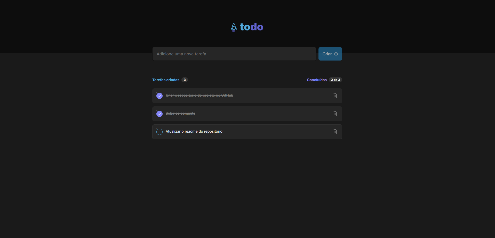

# ToDo List



> Challenge proposed by rocketseat in bootcamp ignite.

### Next Features

O projeto ainda está em desenvolvimento e as próximas atualizações serão voltadas nas seguintes tarefas:

- [ ] Responsive design
- [ ] Store tasks

## 📫 References

For the development of the project the following references were used:

1. [Challenge](https://efficient-sloth-d85.notion.site/Desafio-01-Praticando-os-conceitos-do-ReactJS-91fd63dd1a5b4a2796152de293ec1074)
2. [Figma](https://www.figma.com/file/0n0zDN7zbzhRbaEO74Xesx/ToDo-List/duplicate)

## 🚀 Installing

To install the project, follow these steps:

Clone the repository:

```
$ git clone https://github.com/mateuscastro-dev/to-do-list.git
```

Installing dependencies:

```
$ yarn install
```

## ☕ Running

Start dev server:

```
$ yarn dev
```
